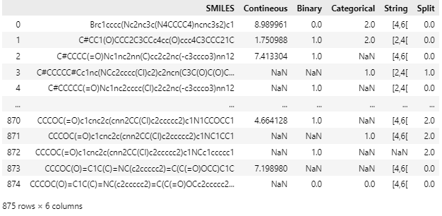
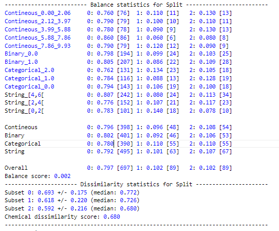

# OptiSplit

A tool to create well-balanced and robust data splits for (sparse) molecular datasets without data leakage between different tasks.

This package is based on the work of Giovanni Tricarico presented in [Construction of balanced, chemically dissimilar training, validation and test sets for machine learning on molecular datasets](https://chemrxiv.org/engage/chemrxiv/article-details/6253d85d88636ca19c0de92d). 

The principle idea is to first cluster molecules (and data points) into many small clusters and in the second step to use linear programming to combine the initial clusters into subsets to that the final fraction of molecules and the fraction of data point per task in each final subset is as close as possible to the desired fractions.

## Installation
```
pip install git+https://git@github.com/sohviluukkonen/OptiSplit.git@main
```

## CLI
The split can be easily created from the command line with

```
python -m optisplit.cli -i <dataset.csv>
```
with <datasets.csv> a pivoted dataset where each row corresponds to unique molecules and each task has its own column. For more options use `-h/--help`.

## API

### sklearn-style splitter

OptiSplit offers two main modes, either to
  
1. create a single split with an arbitrary number of subsets of custom size, by specifying the argument `size`
2. create a k-fold cross-validation split, by specifying the argument `n_splits`


By default, the molecules are initially clustered based on their Morgan fingerprints with `MaxMinClustering`. See [clustering](#clustering) for alternative clustering approaches and details.

Also by default, each of the input tasks are stratified into subtasks that are used during the linear programming. For more details see [additional parameters](#additional-parameters).

Example data:
```
import pandas as pd

# Load data
data = pd.read_csv('optisplit/test_data.csv')
smiles_list = data.SMILES.tolist()
y = data.drop(columns=['SMILES']).to_numpy()
X = np.zeros((y.shape[0], 1)) # dummy not need in optisplit but required by the sklearn-format
```

#### Single Split

```
from optisplit.splitters import OptiSplit

# Single 80-10-10 train-validation-test split
split = OptiSplit(sizes=[0.8, 0.1, 0.1]).split(X, y, smiles_list)
for (train_idx, val_idx, test_idx) for split:
    print(f"Train ({len(train_idx)}): {train_idx}")
    print(f"Validation ({len(val_idx)}): {val_idx}")
    print(f"Test ({len(test_idx)}): {test_idx}")
```
Train (697): [1, 2, 3, ..., 872, 873, 874]  
Validation (89): [0, 44, 50, ..., 827, 828, 829]  
Test (89): [10, 14, 15, ..., 830, 833, 834]

#### $k$-folds
```
from optisplit.splitters import OptiSplit

# 5-fold train-test split
split = OptiSplit(n_splits=5).split(X, y, smiles_list)
for i, (train_idx, test_idx) for split:
    print(f"Fold {i}")
    print(f"Train ({len(train_idx)}): {train_idx}")
    print(f"Test ({len(test_idx)}): {test_idx}")
```
Fold 0  
Train (699): [2, 4, 5, ..., 872, 873, 874]  
Test (176): [0, 1, 3, ..., 833, 834, 843]  
Fold 1   
Train (700): [0, 1, 3, ..., 872, 873, 874]  
Test (175): [2, 4, 5, ..., 822, 831, 841]  
Fold 2  
Train (699): [0, 1, 2, ..., 836, 841, 843]  
Test (176): [14, 15, 20, ..., 872, 873, 874]  
Fold 3  
Train (700): [0, 1, 2, ..., 872, 873, 874]  
Test (175): [16, 17, 25, ..., 777, 811, 832]  
Fold 4  
Train (702): [0, 1, 2, ..., 872, 873, 874]  
Test (173): [13, 18, 19, ..., 810, 835, 836]  

### Splitting a dataset

OptiSplit also provides a wrapper function `split_dataset` which creates splits for data in a `.csv` file or `pd.DataFrame`, to compute some metrics (balance and chemical dissimilarity score) and appends the generated splits to the data.

```
from optisplit.data import split_dataset

data_with_splits = split_dataset(data_path="optisplit/test_data.csv", splitter=OptiSplit(sizes=[0.8, 0.1, 0.1]))
data_with_splits
```
 

and optisplit.log file is created in which some splits statistics are saved:  


### Additional OptiSplit attributes

Multiple splits
- `n_repeats` (int, *default=1*): multiple splits can be created at once (only works with some of the clustering methods)

Stratification
- `stratify` (bool | list[str], *default=True*): 
- `stratify_reg_nbins` (int, *default=5*):

Objective weights
- `equal_weight_perc_compounds_as_tasks` (bool, *default=False*):
- `custom_weights` (list[float], *default=None*):

LP early stopping
- `absolute_gap` (float, *default=1e-3*)
- `time_limit_seconds` (int, *default=None*)

### Clustering 

### Analysing and visualising a split
